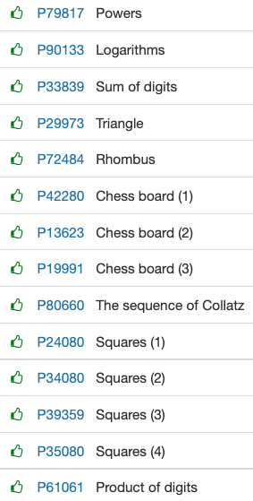

# Bucles dins de bucles

# **[Bucles dins de bucles](https://jutge.org/problems#)**



[P79817](https://jutge.org/problems/P79817_en) Powers

```java
import java.util.*;

public class Main {
    public static void main(String args[]){
        Scanner input = new Scanner(System.in);
        
        int a, b;

        while(input.hasNextInt()){
            a = input.nextInt();
            b = input.nextInt();
            System.out.println(Math.round(Math.pow(a, b)));
        }
    }  

}
```

---

[P90133](https://jutge.org/problems/P90133_en) Logarithms

```java
import java.util.*;

public class Main {
    public static void main(String args[]){
        Scanner input = new Scanner(System.in);
        
        int a, b;

        while(input.hasNextInt()){
            a = input.nextInt();
            b = input.nextInt();
            if(a == 10 && b > 10)   System.out.println((int) Math.log10(b));
            else    System.out.println((int) log(b, a));
        }
    }  

    public static double log(int x, int b) {
        return Math.log(x) / Math.log(b);
    }
}
```

---

[P33839](https://jutge.org/problems/P33839_en) Sum of digits

```java
import java.util.*;

public class Main {
    public static void main(String args[]){
        Scanner input = new Scanner(System.in);
        
        int a, a_;

        while(input.hasNextInt()){
            a = input.nextInt();
            a_ = a;
            
            int s = 0;

            while(a > 9){
                s = s + a%10;
                a = a/10;
            }
            
            s = s + a;

            System.out.println("The sum of the digits of " + a_ + " is " + s + ".");
            
        }
    }  
}
```

---

[P29973](https://jutge.org/problems/P29973_en) Triangle

```java
import java.util.*;

public class Main {
    public static void main(String args[]){
        Scanner input = new Scanner(System.in);
        
        int n = input.nextInt();
        for(int i = 1; i < n+1; i++){
            for(int c = 0; c < i; c++){
                System.out.print('*');
            }
            System.out.println();            
        }
    }  
}
```

---

[P72484](https://jutge.org/problems/P72484_en) Rhombus

```java
import java.util.*;

public class Main {
    public static void main(String args[]){
        Scanner input = new Scanner(System.in);
        
        int n = input.nextInt();
        for (int i = 1; i <= n; i++) {
            for (int j = 0; j < n-i; j++) System.out.print(' ');
            for (int j = 0; j < i*2-1; j++) System.out.print('*');
            System.out.println();
        }
        for (int i = 1; i < n; i++) {
            for (int j = 0; j < i; j++) System.out.print(' ');
            for (int j = 0; j < (n-i)*2-1; j++) System.out.print('*');
            System.out.println();
        }
    }  
}
```

---

[P42280](https://jutge.org/problems/P42280_en) Chess board (1)

```cpp
#include <iostream>
#include <string>

using namespace std;

int main(){
    int  r, c;
    cin >> r >> c;
    //cout << r << ' ' << c << endl;

    int sum = 0;

    string s;
    for(int i = 0; i < r; i++){
        //cout << i << endl;
        
        cin >> s;
        
        for(int j = 0; j < c; j++){
			//cout << j;
			int a = s[j] - '0';
            sum = sum + a;
		}
    }
    
    cout << sum << endl;

}

//cin >> s;
/*
        for(int j = 0; i < c; j++){
            cout << i << ' ' << j << endl;

            //int a = s[j] - '0';
```

---

[P13623](https://jutge.org/problems/P13623_en) Chess board (2)

```cpp
#include <iostream>
using namespace std;

int main () {
	int f,c;
    cin >> f >> c;
    char ch;
    int res = 0;
    for (int i = 0; i < f; i++) {
        for (int j = 0; j < c; j++) {
            cin >> ch;
            if (i%2==j%2) res += (int)ch-'0';
        }
    }
    cout << res << endl;
}
```

---

[P19991](https://jutge.org/problems/P19991_en) Chess board (3)

```cpp
#include <iostream>
using namespace std;

int main () {
	int n;
    char ch;
    int res = 0;
    cin >> n;
    for (int i = 0; i < n; i++) {
        for (int j = 0; j < n; j++) {
            cin >> ch;
            if (i==j or i+j==n-1) res += (int)ch-'0';
        }
    }
    cout << res << endl;
}

/*
 * 1 2 3 30
 * 5 6 21 8
 * 9 12 B C
 * 03 E F 0
 * 
 * 
 */
```

---

[P80660](https://jutge.org/problems/P80660_en) The sequence of Collatz

```cpp
#include <iostream>
using namespace std;

int main () {
	int n;
    while (cin >> n) {
        int cont = 0;
        while (n!=1) {
            cont++;
            if (n%2==0) n/=2;
            else n = 3*n +1;
        }
        cout << cont << endl;
    }
}
```

---

[P24080](https://jutge.org/problems/P24080_en) Squares (1)

```cpp
#include <iostream>
using namespace std;

int main () {
	int n;
    bool primer = true;
    while (cin >> n) {
        if (!primer) cout << endl;
        else primer = false;
        for (int i = 0; i < n; i++) {
            for (int j = 0; j < n; j++) cout << n;
            cout << endl;
        }
    }
}
```

---

[P34080](https://jutge.org/problems/P34080_en) Squares (2)

```cpp
#include <iostream>
using namespace std;

int main () {
	int n;
    bool primer = true;
    while (cin >> n) {
        if (!primer) cout << endl;
        else primer = false;
        for (int i = 0; i < n; i++) {
            for (int j = 0; j < n; j++) cout << (i*n+j)%10;
            cout << endl;
        }
    }
}
```

---

[P39359](https://jutge.org/problems/P39359_en) Squares (3)

```cpp
#include <iostream>
using namespace std;

int main () {
	int n,d=0;
    bool primer = true;
    while (cin >> n) {
        if (!primer) cout << endl;
        else primer = false;
        for (int i = 0; i < n; i++) {
            for (int j = 0; j < n; j++) cout << (i*n+j+d)%10;
            cout << endl;
        }
        d = (n*n+d)%10;
    }
}
```

---

[P35080](https://jutge.org/problems/P35080_en) Squares (4)

```cpp
#include <iostream>
using namespace std;

int main () {
	int n;
    bool primer = true;
    cin >> n;
    for (int i = 0; i < n; i++) {
        if (!primer) cout << endl;
        else primer = false;
        for (int i = 0; i < n; i++) {
            for (int j = 0; j < n; j++) cout << (i*n+j)%10;
            cout << endl;
        }
    }
}
```

---

[P61061](https://jutge.org/problems/P61061_en) Product of digits

```cpp
#include <iostream>
using namespace std;

int main () {
	long long n;
    bool primer = true;
    while (cin >> n) {
        long long res = 1, m = n;
        if (n < 10) cout << "El producte dels digits de " << n << " es " << n << '.' << endl;
        while (m >= 10) {
            res = 1;
            while (m >= 1) {
                res *= m%10;
                m/=10;
            }
            cout << "El producte dels digits de " << n << " es " << res << '.' << endl;
            n = res;
            m = n;
        }
        cout << "----------" << endl;
    }
}
```

---
