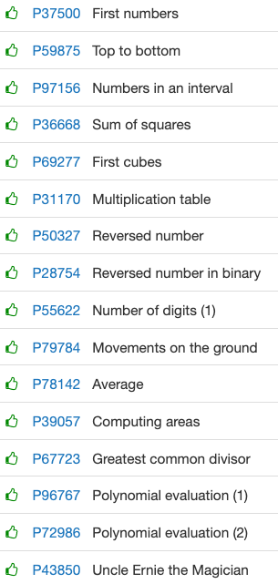

# Primers Bucles

# **[Primers bucles](https://jutge.org/problems#)**



[P37500](https://jutge.org/problems/P37500_en)  First numbers

```java
import java.util.*;

public class Main {
    public static void main(String args[]){
        Scanner input = new Scanner(System.in);
        
        int n = input.nextInt();

        for(int i=0; i<n+1; i++)  System.out.println(i);

    }   
}
```

---

[P59875](https://jutge.org/problems/P59875_en) Top to bottom

```java
import java.util.*;

import javax.print.event.PrintEvent;

public class Main {
    public static void main(String args[]){
        Scanner input = new Scanner(System.in);
        
        int n = input.nextInt();
        int c = input.nextInt();

        if(n > c){
            while(n >= c){
                System.out.println(n);
                n--;
            }
        } else if(c > n){
            while(c >= n){
                System.out.println(c);
                c--;
                
            }
        }else   System.out.println(n);
        
    }   
}
```

---

[P97156](https://jutge.org/problems/P97156_en) Numbers in an interval

```java
import java.util.*;

import javax.print.event.PrintEvent;

public class Main {
    public static void main(String args[]){
        Scanner input = new Scanner(System.in);
        
        int a = input.nextInt();
        int b = input.nextInt();

        for(int i = a; i < b; i++)  System.out.print(i + ",");
        if(b >= a)  System.out.print(b);
        
        System.out.println();
            
    }
    
}
```

---

[P36668](https://jutge.org/problems/P36668_en) Sum of squares

```java
import java.util.*;

public class Main {
    public static void main(String args[]){
        Scanner input = new Scanner(System.in);
        int n = input.nextInt();
        System.out.println(computa(n));
        
    }  

    public static int computa(int c){
        if(c == 0)  return c;
        return c*c + computa(c-1);
    }
}
```

---

[P69277](https://jutge.org/problems/P69277_en) First cubes

```java
import java.util.*;

import javax.print.event.PrintEvent;

public class Main {
    public static void main(String args[]){
        Scanner input = new Scanner(System.in);
        
        int a = input.nextInt();

        for(int i = 0; i < a; i++)  System.out.print(i*i*i + ",");
        
        System.out.println(a*a*a);
            
    }
    
}
```

---

[P31170](https://jutge.org/problems/P31170_en) Multiplication table

```java
import java.util.*;

import javax.print.event.PrintEvent;

public class Main {
    public static void main(String args[]){
        Scanner input = new Scanner(System.in);
        
        int c = input.nextInt();

        for(int i=1; i < 11; i++){ //i intera del 0 al 10
            System.out.println(c + "*" + i + " = " + (c*i));
        }
            
    }
    
}
```

---

[P50327](https://jutge.org/problems/P50327_en) Reversed number

```java
import java.util.*;

import javax.print.event.PrintEvent;

public class Main {
    public static void main(String args[]){
        Scanner input = new Scanner(System.in);
        
        String c = input.nextLine();
        char ch;
        String revString = "";

        for (int i=0; i<c.length(); i++){
            ch = c.charAt(i); 
            revString= ch+revString; 
        }
        System.out.println(revString);
            
    }
    
}
```

---

[P28754](https://jutge.org/problems/P28754_en) Reversed number in binary

```java
import java.util.*;

import javax.print.event.PrintEvent;

public class Main {
    public static void main(String args[]){
        Scanner input = new Scanner(System.in);
        
        int n = input.nextInt();

        while (n > 1) {
            System.out.print(n%2); 
            n= n/2;
        }
        if (n == 0) System.out.println("0");
        else System.out.println("1");      
    }
    
}
```

---

[P55622](https://jutge.org/problems/P55622_en) Number of digits (1)

```java
import java.util.*;

public class Main {
    public static void main(String args[]){
        Scanner input = new Scanner(System.in);
        
        String n = input.nextLine();
        int size = n.length();  
        System.out.println("The number of digits of " + n + " is " + size + ".");
            
    }
}
```

---

[P79784](https://jutge.org/problems/P79784_en) Movements on the ground

```java
import java.util.*;

import javax.print.event.PrintEvent;

public class Main {
    public static void main(String args[]){
        Scanner input = new Scanner(System.in);
        int x = 0, y = 0;

        while(input.hasNextLine()){
            String n = input.nextLine();
            x = 0; y = 0;

            for (int i=0; i < n.length(); i++){
                if (n.charAt(i) == 'n') --y;
                else if (n.charAt(i) == 's') ++y;
                else if (n.charAt(i) == 'e') ++x;
                else x--;
            }
        }
        //if(x == 0 && y == 0)    System.out.println("(0, 0)");
        System.out.println("(" + x + ", " + y + ")");    
    
    }  
}
```

---

[P78142](https://jutge.org/problems/P78142_en) Average

```java
import java.util.*;

import java.math.RoundingMode;
import java.text.DecimalFormat;

public class Main {
    private static final DecimalFormat df = new DecimalFormat("0.00");
    public static void main(String args[]){
        
        Scanner input = new Scanner(System.in);
        double sum = 0.0;
        double count = 0.0;

        while(input.hasNextDouble()){
            sum = sum + input.nextDouble();
            count++;
        }    
        System.out.println(df.format(sum/count));
    }  
}
```

---

[P39057](https://jutge.org/problems/P39057_en) Computing areas

```java
import java.util.*;

import java.math.RoundingMode;
import java.text.DecimalFormat;

public class Main {
    private static final DecimalFormat df = new DecimalFormat("0.000000");
    public static void main(String args[]){
        
        Scanner input = new Scanner(System.in);
        int n = input.nextInt();
        
        String s = input.nextLine();
        
        String[] splited = s.split(" ");        
        
        if(splited[0].equals("rectangle")){
            double a = Double.parseDouble(splited[1]);
            double b = Double.parseDouble(splited[2]);
            System.out.println(df.format(a*b));

        }else if(splited[0].equals("circle")){
            double a = Double.parseDouble(splited[1]);
            double r = Math.PI*a*a;
            System.out.println(df.format(r));
        }   
        s = input.nextLine();

        for(int i = 0; i < n-1; i++){
            s = input.nextLine();
            
            splited = s.split(" ");
            
            if(splited[0].equals("rectangle")){
                double a = Double.parseDouble(splited[1]);
                double b = Double.parseDouble(splited[2]);
                System.out.println(df.format(a*b));

            }else if(splited[0].equals("circle")){
                double a = Double.parseDouble(splited[1]);
                double r = Math.PI*a*a;
                System.out.println(df.format(r));
            }   
            
        }
    }  
}
```

---

[P67723](https://jutge.org/problems/P67723_en) Greatest common divisor

```java
import java.util.*;

public class Main {
    public static void main(String args[]){
        Scanner input = new Scanner(System.in);
        int a = input.nextInt();
        int b = input.nextInt();
        System.out.println("The gcd of " + a + " and " + b + " is " + gcd(a, b)+ ".");
        
    }  

    //euclidean algorithm
    public static int gcd(int a, int b){
        if(a == 0)  return b;
        else if(b == 0) return a;
        else{
            int q = a % b;
            return gcd(b, q);
        }    
    }
}
```

---

[P96767](https://jutge.org/problems/P96767_en) Polynomial evaluation (1)

```java
import java.util.*;

import java.math.RoundingMode;
import java.text.DecimalFormat;

public class Main {
    private static final DecimalFormat df = new DecimalFormat("0.0000");
    public static void main(String args[]){
        Scanner input = new Scanner(System.in);
        double n = input.nextDouble();
        double sum=0;
        int j=0;

        while(input.hasNextDouble()){
            sum = sum + input.nextDouble()*Math.pow(n, j);
            j++;
        }

        System.out.println(df.format(sum));        
    }  

}
```

---

[P72986](https://jutge.org/problems/P72986_en) Polynomial evaluation (2)

```java
import java.util.*;

import java.math.RoundingMode;
import java.text.DecimalFormat;

public class Main {
    private static final DecimalFormat df = new DecimalFormat("0.0000");
    public static void main(String args[]){
        Scanner input = new Scanner(System.in);
        double n = input.nextDouble();
        double sum=0;

        //Algorisme de Horner
        while(input.hasNextDouble()){
            sum = (sum*n) + input.nextDouble();
        }
        
        System.out.println(df.format(sum));        
    }  

}
```

---

[P43850](https://jutge.org/problems/P43850_en) Uncle Ernie the Magician

```java
import java.util.*;

import java.math.RoundingMode;
import java.text.DecimalFormat;

public class Main {
    private static final DecimalFormat df = new DecimalFormat("0.0000");
    public static void main(String args[]){
        Scanner input = new Scanner(System.in);
        
        int result = 0;
        int out;
        
        while(input.hasNextInt()){
            result = input.nextInt();
            out = ((((result/5) - 9) / 4) - 6) / 5;
            System.out.println(out);
            
        }
    }  

}
```

---