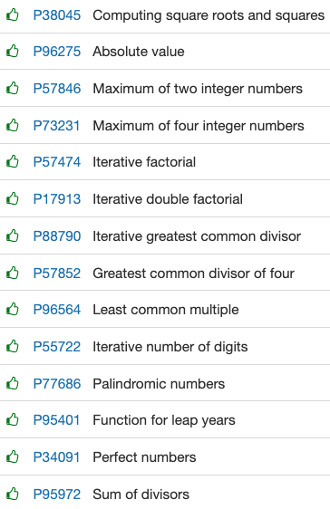

# Primers procediments

# [Primers procediments](https://jutge.org/problems)



[P38045](https://jutge.org/problems/P38045_en) Computing square roots and squares

```java
import java.util.*;

import java.math.RoundingMode;
import java.text.DecimalFormat;

public class Main {
    private static final DecimalFormat df = new DecimalFormat("0.000000");
    public static void main(String args[]){
        Scanner input = new Scanner(System.in);
        
        while(input.hasNextInt()){
            int n = input.nextInt();

            System.out.print(n*n + " ");
            System.out.println(df.format(Math.sqrt(n)));
        }
        
    }  
}
```

---

[P96275](https://jutge.org/problems/P96275_en) Absolute value

```java
import java.util.*;

class Main{
    public static void main(String[] args) {
        final Scanner sc = new Scanner(System.in);
        int n = sc.nextInt();
        System.out.println(absolute(n));
      }
    public static int absolute(int n){
        if(n < 0)   return -n;
        return n;
    }
}
```

---

[P57846](https://jutge.org/problems/P57846_en) Maximum of two integer numbers

```java
import java.util.*;

class Main{
    public static void main(String[] args) {
        final Scanner sc = new Scanner(System.in);
        while(sc.hasNextInt()){
          int a = sc.nextInt();
          int b = sc.nextInt();
          System.out.println(max2(a, b));
        }
        
      }
    public static int max2(int a, int b){
        if(a > b)   return a;
        return b;
    }
}
```

---

[P73231](https://jutge.org/problems/P73231_en) Maximum of four integer numbers

```java
import java.util.*;

class Main{
    public static void main(String[] args) {
        final Scanner sc = new Scanner(System.in);
        while(sc.hasNextInt()){
          int a = sc.nextInt();
          int b = sc.nextInt();
          int c = sc.nextInt();
          int d = sc.nextInt();
          System.out.println(max4(a, b, c, d));
        }
        
      }
      public static int max4(int a, int b, int c, int d){
        int[] nums = {a, b, c, d};
        int largest = a; //by default, si és 0 en cas de que a, b, c i d fossin negatius no funcionaria

        for(int i = 0; i < nums.length; i++){
          if(nums[i] > largest) largest = nums[i];
        }

        return largest;
    }
}
```

---

[P57474](https://jutge.org/problems/P57474_en) Iterative factorial

```java
import java.util.*;

class Main{
    public static void main(String[] args) {
        final Scanner sc = new Scanner(System.in);
        while(sc.hasNextInt()){
          int a = sc.nextInt();
          System.out.println(factorial(a));
        }
        
      }
      public static int factorial(int n){
        int result = 1;

        for(int i = 1; i <= n; i++) {
          result = result * i;
        }
        return result;
    }
}
```

---

[P17913](https://jutge.org/problems/P17913_en) Iterative double factorial

```java
import java.util.*;

class Main{
    public static void main(String[] args) {
        final Scanner sc = new Scanner(System.in);
        while(sc.hasNextInt()){
          int a = sc.nextInt();
          System.out.println(doubleFactorial(a));
        }
        
      }
      public static int doubleFactorial(int n){
        int result = 1;

        for (int i = n; i >= 0; i = i-2){
            if (i == 0 || i == 1) return result;
            else  result = result * i;
        }
         
        return result;
      }
}
```

---

[P88790](https://jutge.org/problems/P88790_en) Iterative greatest common divisor

```java
import java.util.*;

class Main{
    public static void main(String[] args) {
        final Scanner sc = new Scanner(System.in);
        while(sc.hasNextInt()){
          int a = sc.nextInt();
          int b = sc.nextInt();
          System.out.println(gcd(a, b));
        }
        
      }
      public static int gcd(int a, int b){ //euclidean algorithm
        int auxiliar = 0;
        while (b != 0) {
            auxiliar = b;
            b = a % b;
            a = auxiliar;
        }
        return a;
      }
}
```

---

[P57852](https://jutge.org/problems/P57852_en) Greatest common divisor of four

```java
import java.util.*;

class Main{
    public static void main(String[] args) {
        final Scanner sc = new Scanner(System.in);
        while(sc.hasNextInt()){
          int a = sc.nextInt();
          int b = sc.nextInt();
          int c = sc.nextInt();
          int d = sc.nextInt();
          System.out.println(gcd4(a, b, c, d));
        }
        
      }
      public static int gcd4(int a, int b, int c, int d){
        int[] nums = {a, b, c, d};
        int result = nums[0];
        
        for(int i = 1; i < nums.length; i++){
          result = gcd(result, nums[i]);
        }
        
        return result;
      }

      public static int gcd(int a, int b){ //euclidean algorithm
        int auxiliar = 0;
        while (b != 0) {
            auxiliar = b;
            b = a % b;
            a = auxiliar;
        }
        return a;
      }
}
```

---

[P96564](https://jutge.org/problems/P96564_en) Least common multiple

```java
import java.util.*;

class Main{
  public static void main(String[] args) {
    final Scanner sc = new Scanner(System.in);

    while(true){
      int n = sc.nextInt();
      if(n == 0)  return;
      
      float result = 1;

      for(int i = 0; i < n; i++){
        float c = sc.nextInt();
        result = lcm(result, c);
      }

      System.out.println(Float.toString(result));
      }
  }

  public static float lcm(float a, float b){
    return (a*b)/gcd(a, b);
  }

  public static float gcd(float a, float b){ //euclidean algorithm
    float auxiliar = 0;
    while (b != 0) {
        auxiliar = b;
        b = a % b;
        a = auxiliar;
    }
    return a;
  }
}
```

---

[P55722](https://jutge.org/problems/P55722_en) Iterative number of digits

```java
import java.util.*;

class Main{
  public static void main(String[] args) {
    final Scanner sc = new Scanner(System.in);
    while(sc.hasNextInt()){
      int a = sc.nextInt();
      System.out.println(numberOfDigits(a));
    }
  }

  public static int numberOfDigits(int n){
    int length = 0;
    long aux = 1;
    while (aux <= n) {
      length++;
      aux = aux * 10;
    }
    if(length == 0) return 1;
    return length;
  }
}
```

---

[P77686](https://jutge.org/problems/P77686_en) Palindromic numbers

```java
import java.util.*;

class Main{
  public static void main(String[] args) {
    final Scanner sc = new Scanner(System.in);
    while(sc.hasNextInt()){
      int a = sc.nextInt();
      System.out.println(isPalindromic(a));
    }
  }

  public static boolean isPalindromic(int n){
    if(n == invert(n))  return true;
    else return false;
  }

  public static int invert(int n){
    int inverted = 0; 
    while(n != 0){ 
        inverted = inverted*10 + n%10;                        
        n = n/10; 
    }
    return inverted; 
  }
}
```

---

[P95401](https://jutge.org/problems/P95401_en) Function for leap years

```java
import java.util.*;

class Main{
  public static void main(String[] args) {
    final Scanner sc = new Scanner(System.in);
    while(sc.hasNextInt()){
      int a = sc.nextInt();
      System.out.println(isLeapYear(a));
    }
  }

  public static boolean isLeapYear(int year){
    if(year%100 == 0){
      if (((year/100)%4) == 0)    return true;
      return false;
      
    }else if(year%4 == 0 && year/10 != 0 && year/100 != 0) return true;
    return false;
  }
}
```

---

[P34091](https://jutge.org/problems/P34091_en) Perfect numbers

```java
//Aquest és funcional per a tots els reals, el jutge no l'accepta
import java.util.*;

class Main{
  public static void main(String[] args) {
    final Scanner sc = new Scanner(System.in);
    while(sc.hasNextInt()){
      int a = sc.nextInt();
      System.out.println(isPerfect(a));
    }
  }

  public static boolean isPerfect(int n){
    if(n == 1)  return false;

    int sumOfDivisors = 1;
    for (int i = 2; i < n; i++) {
      if (n % i == 0) {
          sumOfDivisors = sumOfDivisors + i;
      }  
    }

    if(sumOfDivisors == n)  return true;
    return false;

  }
}
```

```java
//Aquest és funcional tenint en compte la restricció de la mida d'un enter, el jutge l'accepta
import java.util.*;

class Main{
  public static void main(String[] args) {
    final Scanner sc = new Scanner(System.in);
    while(sc.hasNextInt()){
      int a = sc.nextInt();
      System.out.println(isPerfect(a));
    }
  }

  public static boolean isPerfect(int n){
    switch (n) {
      case 6 : return true;
      case 28 : return true;
      case 496 : return true;
      case 8128 : return true;
      case  33550336 : return true;
      default : return false;
  }

  }
}
```

---

[P95972](https://jutge.org/problems/P95972_en) Sum of divisors

```java
import java.util.*;

class Main{
  public static void main(String[] args) {
    final Scanner sc = new Scanner(System.in);
    while(sc.hasNextInt()){
      int a = sc.nextInt();
      System.out.println(sumDivisors(a));
    }
  }

  public static int sumDivisors(int x){
    int sumOfDivisors = 1;
    for (int i = 2; i <= x; i++) {
      if (x % i == 0) {
          sumOfDivisors = sumOfDivisors + i;
      }  
    }
    return sumOfDivisors;
  }
}
```

---
