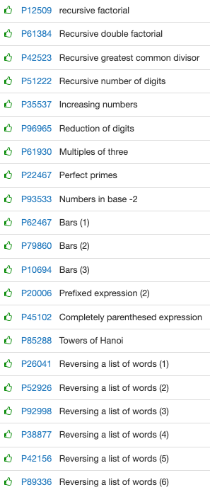

# Recursivitat

# **[Recursivitat](https://jutge.org/problems#)**



[P12509](https://jutge.org/problems/P12509_en) Recursive factorial

```cpp
#include <iostream>
using namespace std;

int factorial(int n){
    if(n==0) return 1;
    else return n * factorial(n-1);
}
int main() {
    int n;
    while(cin >> n){
        cout << factorial(n) << endl;
    }
    
    
}
```

---

[P61384](https://jutge.org/problems/P61384_en) Recursive double factorial

```cpp
#include <iostream>
using namespace std;

 int factorial_doble(int n) {
    if (n <= 1) return 1;
    if (n == 2) return 2;
    return n*factorial_doble(n-2);
 }

int main () {
	int n;
    while (cin >> n) cout << factorial_doble(n) << endl;
}
```

---

[P42523](https://jutge.org/problems/P42523_en) Recursive greatest common divisor

```cpp
#include <iostream>
#include <cmath>
using namespace std;

int gcd(int a, int b){
    if(a == 0)
        return b;
    else if(b == 0)
        return a;
    else{
        int q = a % b;
        //cout << "b AND q: " << b << ' ' << q << endl;
        return gcd(b, q);
        
    }    

}

int main() {
    int a, b;
    
    while(cin >> a >> b){
        
        int r = gcd(a, b);
        
        cout << r << endl;
    }
    
}
```

---

[P51222](https://jutge.org/problems/P51222_en) Recursive number of digits

```cpp
#include <iostream>
using namespace std;

int number_of_digits(int n){
    if(n<10){
         return 1;
     }
    else{
        return 1 + number_of_digits(n / 10);
    }
}

int main() {
    int n;
    
    while(cin >> n){
        int out = number_of_digits(n);
        cout << out << endl;
    }
}
```

---

[P35537](https://jutge.org/problems/P35537_en) Increasing numbers

```cpp
#include <iostream>
#include <cmath>
using namespace std;

bool is_increasing(int n){
    if(n < 10)  return true;
    
    int a = n%10;
    n = n/10;
    
    int b = n%10;
    
    if(a >= b) return is_increasing(n);
    return false;
}

int main() {
    int n;
    cin >> n;
    
    cout << is_increasing(n) << endl;
}
```

---

[P96965](https://jutge.org/problems/P96965_en) Reduction of digits

```cpp
#include <iostream>
using namespace std;

int sum_of_digits(int n) {
    if (n == 0) return 0;
    return n%10 + sum_of_digits(n/10);
}

int reduction_of_digits(int n) {
    if (n < 10) return n;
    return reduction_of_digits(sum_of_digits(n));
}

int main() {
    int n;
    while(cin >> n ){
    cout << reduction_of_digits(n) << endl;
    }
}
```

---

[P61930](https://jutge.org/problems/P61930_en) Multiples of three

```cpp
#include <iostream>
using namespace std;

int sum_of_digits(int n) {
    if (n == 0) return 0;
    return n%10 + sum_of_digits(n/10);
}

bool is_multiple_3(int n){
    if(sum_of_digits(n)%3 == 0) return true;
    return false;
}

int main() {
    int n;
    
    while(cin >> n){
        cout << is_multiple_3(n) << endl;
    }
}
```

---

[P22467](https://jutge.org/problems/P22467_en) Perfect primes

```cpp
#include <iostream>
using namespace std;

int sum_of_digits(int n) {
    if (n == 0) return 0;
    return n%10 + sum_of_digits(n/10);
}

bool is_prime(int n){
    if(n==0)    return false;    
    for(int i=2; i*i<=n; i++){
        if(n%i == 0)    return false;
        
    }
    return true;
}

bool is_perfect_prime(int n){
    
    if(n==1 || n==0)    return false;
    if(n<10)    return is_prime(n);
    
    if(is_prime(n)) return is_perfect_prime(sum_of_digits(n));
    
    return false;
}

int main() {
    int n;
    while(cin >> n){
        cout << is_perfect_prime(n) << endl;
    }
}
```

---

[P93533](https://jutge.org/problems/P93533_en) Numbers in base -2

```cpp
/*
 * cas base == 0 --> s'atura i no fa res
 * 
 * 
 * fer valor absolut de n i dps si és parell té un 0 de resto i si és senar un 1
 * 
 * 
 * el quocient el treiem de la eq: n= p*q + r
 *                                  la p és -2
 *                                  la n és el input
 *                                  la q el quocient 
 *
 * 
 * */

#include <iostream>
#include <cstdlib>
using namespace std;

void decToBinary(int n){
    if(n == 0)  return;
    
    int n_abs = abs(n);
    
    int r;
    
    if(n_abs%2 == 0){ //és parell
        r = 0;
        
        //cout << "Parell";
    }else if(n_abs%2 == 1){
        r = 1;
        //cout << "Senar";

    }
    
    //calcular el quocient
    int q = (n - r) / -2;
    

    decToBinary(q);
    cout << r;

}

int main()
{
	int n;
    while(cin >> n){
        if(n == 0) cout << "0: 0" << endl;
        else{
            cout << n << ": ";
            decToBinary(n);
                  
            cout << endl;
        }
    }   
}
```

---

[P62467](https://jutge.org/problems/P62467_en) Bars (1)

```cpp
#include <iostream>
#include <string>
#include <cmath>
using namespace std;

void nMenysU(int n){
    
    if(n == 1){
        cout << '*' << endl;
        return;
    }
    
    nMenysU(n-1);
    
    /*
    for(int i=0; i<n-1; i++){
        cout << '*';
    }
    */
    
    cout << string(n, '*') << endl;
    
    
    nMenysU(n-1);
      
       
    //cout << endl;
    
}

int main() {
    int n;
    string s;
    
    
    cin >> n;
    nMenysU(n);
   
    
}
```

---

[P79860](https://jutge.org/problems/P79860_en) Bars (2)

```cpp
#include <iostream>
#include <string>
#include <cmath>
using namespace std;

void nMenysU(int n){
    
    if(n == 1){
        cout << '*' << endl;
        return;
    }
    
    cout << string(n, '*') << endl;
    
    nMenysU(n-1);
    
    /*
    for(int i=0; i<n-1; i++){
        cout << '*';
    }
    */
    

    
    
    nMenysU(n-1);
      
       
    //cout << endl;
    
}

int main() {
    int n;
    string s;
    
    
    cin >> n;
    nMenysU(n);
   
    
}
```

---

[P10694](https://jutge.org/problems/P10694_en) Bars (3)

```cpp
#include <iostream>
#include <string>
#include <cmath>
using namespace std;

void nMenysU(int n){
    
    if(n == 1){
        cout << '*' << endl;
        return;
    }
    
    
    nMenysU(n-1);
    
    /*
    for(int i=0; i<n-1; i++){
        cout << '*';
    }
    */
    

    
    
    nMenysU(n-1);
    cout << string(n, '*') << endl;
      
       
    //cout << endl;
    
}

int main() {
    int n;
    string s;
    
    
    cin >> n;
    nMenysU(n);
   
    
}
```

---

[P20006](https://jutge.org/problems/P20006_en) Prefixed expression (2)

```cpp
#include <iostream>
#include <string>

/*
 * El cin va dins de la funció recursiva
 * 
 * la funció recursiva és void -- ja no jajaj
 * 
 * 
*/

/*
 * si num
 *  directe out
 * 
 * si operació
 *  si num
 *      num següent "depen operació" al anterior
 *  
 *  si operació
 *      
 * 
 * 
 * 
 * 
 */

using namespace std;

int computa(){
        char c;
        cin >> c;
        
        if (c == '+') return computa() + computa();
        if (c == '-') return computa() - computa();
        if (c == '*') return computa()*computa();
        int m = c - '0';
        return m;
}
 
int main(){
        cout << computa() << endl;
}
```

---

[P45102](https://jutge.org/problems/P45102_en) Completely parenthesed expression

```cpp
#include <iostream>
using namespace std;

int computa(){
        char c;
        cin >> c;
        
        if(isdigit(c)){
            int m = c - '0';
            return m;
        }
        
        int num1 = computa();
        int op;
            
        cin >> c;
        if (c == '+') op = num1 + computa();
        else if (c == '-') op = num1 - computa();
        else op = num1*computa();
        
        cin >> c;
        return op;
}
 
int main(){
    cout << computa() << endl;
}
```

---

[P85288](https://jutge.org/problems/P85288_en) Towers of Hanoi

```cpp
#include <iostream>
using namespace std;

int computa(){
        char c;
        cin >> c;
        
        if(isdigit(c)){
            int m = c - '0';
            return m;
        }
        
        int num1 = computa();
        int op;
            
        cin >> c;
        if (c == '+') op = num1 + computa();
        else if (c == '-') op = num1 - computa();
        else op = num1*computa();
        
        cin >> c;
        return op;
}
 
int main(){
    cout << computa() << endl;
}
```

---

[P26041](https://jutge.org/problems/P26041_en) Reversing a list of words (1)

```cpp
#include <iostream>
#include <string>

using namespace std;

void func(){
    string s;
    while(cin >> s){
        
        func();
    }
    if(s.empty())   return; 
    cout << s << endl;
}

int main() {
    func();
}
```

---

[P52926](https://jutge.org/problems/P52926_en) Reversing a list of words (2)

```cpp
#include <iostream>
#include <string>

using namespace std;

void func(){
    string s;
    
    cin >> s;
    
    if(s == "end"){
        return;
    }
    
    func();
    cout << s << endl;
    
    
}

int main() {
    func();
}
```

---

[P92998](https://jutge.org/problems/P92998_en) Reversing a list of words (3)

```cpp
#include <iostream>
#include <string>

using namespace std;

void func(int n){
    string s;
    
    cin >> s;
    
    if(n<1) return;
    
    func(n-1);
    cout << s << endl;
    
    
}

int main() {
    int n;
    cin >> n;
    
    func(n);
}
```

---

[P38877](https://jutge.org/problems/P38877_en) Reversing a list of words (4)

```cpp
#include <iostream>
using namespace std;

void girar(int n, int& i){
        string c;
        if (cin >> c){
                girar(n, i);
                if (i <= n){
                        cout << c << endl;
                        ++i;
                }
        }
        else i = 1;
}
 
int main(){
        int n;
        cin >> n;
        girar(n, n);
}
```

---

[P42156](https://jutge.org/problems/P42156_en) Reversing a list of words (5)

```cpp
#include <iostream>
using namespace std;

int aval (int c) {
    string s;
    int n = c;
    if (cin >> s) {
        n = aval(c+1);
        if (n > 0) cout << s << endl;
        return n-1;
    }
    return c/2 + c%2;
    
}

int main () {
	aval(0);
}
```

---

[P89336](https://jutge.org/problems/P89336_en) Reversing a list of words (6)

```cpp
#include <iostream>

using namespace std;

int printline(int n){
  string s;
  if(cin >> s){
    int nfinal;
    nfinal = printline(n+1);
    if(n <= nfinal/2)cout << s << endl;
    return nfinal;
  } else {
    return n-1;
  }
}

int main() {

  printline(1);

}
```

---
